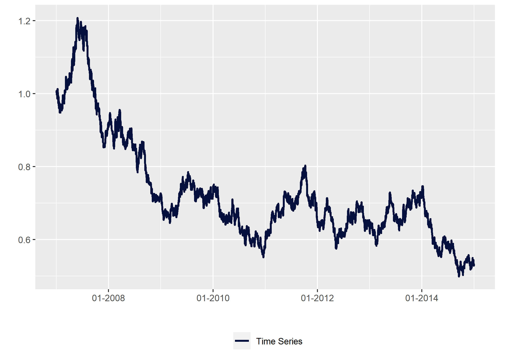

<!-- README.md is generated from README.Rmd. Please edit that file -->

# peRformance

<!-- badges: start -->
<!-- badges: end -->

The goal of peRformance is to provide a range of functions to study and
visualize market or economic data and analyize and benchmark asset
returns.

## Installation

You can install the development version of peRformance from
[GitHub](https://github.com/) with:

``` r
# install.packages("devtools")
devtools::install_github("fscheler/peRformance")
```

## Example application monthly performance overview table

Create a monthly and annual performance overview table in plotly and a
printable version that can be used in markdown documents with the kable
package. Monthly tables are a popular tool in analysis and comparison of
financial time series.

``` r
  library(peRformance)

  #Generate an integrated monthly and annual performance overview using plotly
  date=seq(as.Date("2007-1-1"), as.Date("2015-1-1"), by = "days")
  asset_ret<-rnorm(length(date))/100
  benchmark_ret<-rnorm(length(date))/100
  da<-data.frame(date,asset_ret,benchmark_ret)

  #Including Benchmark Returns
  df<-mperf_table(da,ts_format="returns")  
#>   Year    Jan    Feb    Mar    Apr     May     Jun     Jul    Aug    Sep    Oct
#> 1 2007 -6.41% -1.26%  9.77%  5.95%  -0.23%  -7.04%   3.45%  1.64% -3.18% -2.22%
#> 2 2008  3.62%  0.72% -6.49%  1.84%   -4.2%   9.08%  -3.88%  0.35%  0.76% -7.77%
#> 3 2009 -0.86% -3.46%  4.84%  7.03%   6.06%   1.39%   7.73%  6.33% -7.32% 13.62%
#> 4 2010 -0.71%  7.98%  1.65% -2.26% -10.06% -12.89%   2.36%  7.15% -9.31% -3.37%
#> 5 2011  1.12%  0.23% -3.52%  3.22%   5.37%   5.01%   1.66% -7.16% -2.98%  2.94%
#> 6 2012  -7.6% -4.14%  2.65% -0.94%   0.65%   -3.5% -13.51% -0.72%  5.33%  5.01%
#> 7 2013 -7.68%  0.09% -5.88%  2.65%  -9.69%  10.86%  -3.19% 11.18%  3.27%  3.12%
#> 8 2014  1.87%  1.52% -4.26%  6.74%  -5.68%   2.37%   0.98%   5.4% -6.27%  -0.3%
#> 9 2015 -0.32%                                                                  
#>      Nov    Dec       FY Benchmark
#> 1 -1.51%  2.26%   -0.05%    35.08%
#> 2 -9.09% -9.96%   -23.8%    -12.4%
#> 3  1.01% -1.16%    39.1%   -31.65%
#> 4 -2.71% -2.58%  -23.97%    -4.92%
#> 5 -1.77% -2.49%    0.82%   -29.21%
#> 6  1.65% -4.66%  -19.48%     7.16%
#> 7  0.82%  -2.8%    0.39%    39.19%
#> 8  4.67%  5.75%   12.34%    -8.48%
#> 9                 -0.32%     1.04%

  #Excluding Benchmark Returns  
  df<-mperf_table(da[,c("date","asset_ret")],ts_format="returns",print_output=F)
  
  #Using Index instead of Return Time Series
  date=seq(as.Date("2010-1-1"), as.Date("2015-1-1"), by = "days")
  asset_ret<-cumprod(1+rnorm(length(date))/100)
  benchmark_ret<-cumprod(1+rnorm(length(date))/100)
  da<-data.frame(date,asset_ret,benchmark_ret)
  
  df<-mperf_table(da,ts_format="index",print_output=F)  
  
  #You can also configure the export options and download the plotly graphic as a high resolution svg
  df<-mperf_table(da,ts_format="index",header_color="#3b5171",font_color="#04103b",export_format="svg",
                  chart_export_width=600,chart_export_height=150,print_output=F)  

  #Display Plotly Graphic
  df$fig
```


## Example application recession shading with ggplot2

Apply NBER recession shading to any ggplot2 time series graphic,
directly loading the recession indicator from the St Louis Fed. Please
note, that this function requires an API key that can be generated for
free on the Fed’s website
(<https://fred.stlouisfed.org/docs/api/api_key.html>).

``` r

# Create a return time series

date=seq(as.Date("2007-1-1"), as.Date("2015-1-1"), by = "days")
asset_ret<-cumprod(1+rnorm(length(date))/100)
da<-data.frame(date,asset_ret)

# Initiate a ggplot2 chart

  cols <- c("Time Series" = "#04103b")
  p<-ggplot(data=da,aes(x=as.Date(date), y=asset_ret))
# Add recession shading using the function and your API Key  
# to obtain a key visit: https://fred.stlouisfed.org/docs/api/api_key.html
  tryCatch({
    p<-p + add_rec_shade(as.Date(min(da$date)),as.Date(max(da$date)),fredr_key="your_api_key")
  }, error = function(e) {})
#> NULL
#add formatting  
  p<-p +
    geom_line(size=1,aes(y=asset_ret,color="Time Series"))+
    scale_colour_manual(values = cols)+
    scale_x_date(labels = date_format("%m-%Y"))+
    xlab("")+
    ylab("")+
    theme(legend.position = "bottom",legend.title = element_blank())+
    theme(plot.margin=margin(l=5,r=10,b=5,t=5))
  p
```



## Example application dRawdowns

Analyse frequence, magnitude and length of drawdowns in a given time
series.

``` r

#Study lenght, magnitude and frequency of drawdowns in a time series
date=seq(as.Date("2010-1-1"), as.Date("2015-1-1"), by = "days")
asset_ret<-rnorm(length(date))/100
da<-data.frame(date,asset_ret)

df<-dRawdowns(da)

#Some example output
df$longest_drawdown
#> Time difference of 1807 days
df$longest_peak2through
#> Time difference of 1366 days
#Count number of drawdowns with a trough below threshold value
df$n
#>   ranges observations
#> 1   0.00            2
#> 2  -0.05            1
#> 3  -0.10            1
#> 4  -0.20            1
#> 5  -0.30            1
#> 6  -0.40            1
#> 7  -0.50            1
#> 8   0.60            0
#> 9  -0.70            0
```
