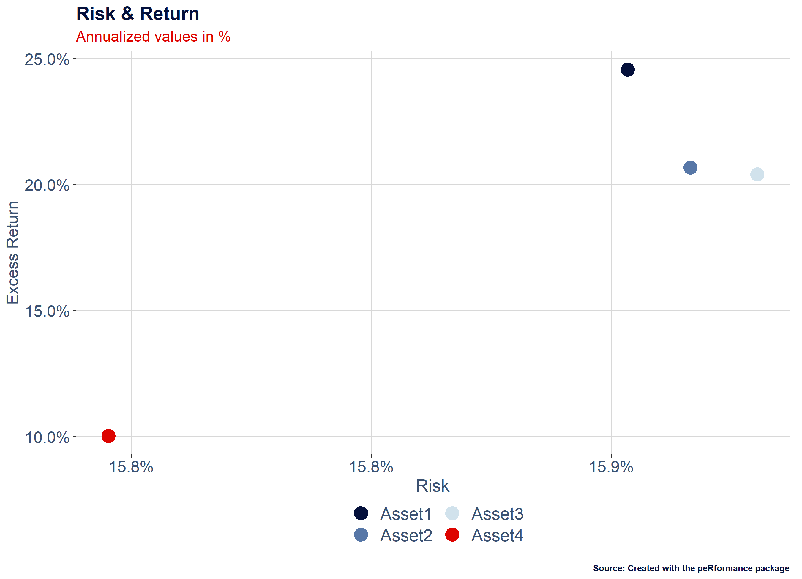

---
 date: "2023-03-09"
 output:
   html_document:
     keep_md: TRUE
---

<!-- README.md is generated from README.Rmd. Please edit that file -->


# peRformance

<!-- badges: start -->
<!-- badges: end -->

The goal of peRformance is to provide a range of functions to study and visualize market or economic data and analyize and benchmark asset returns.

## Installation

You can install the development version of peRformance from [GitHub](https://github.com/) with:

``` r
# install.packages("devtools")
devtools::install_github("fscheler/peRformance")
```

## Example application monthly performance overview table

Create a monthly and annual performance overview table in plotly and a printable version that can be used in markdown documents with the kable package.
Monthly tables are a popular tool in analysis and comparison of financial time series.


```r
  library(peRformance)

  # Generate an integrated monthly and annual performance overview using plotly
  date=seq(as.Date("2007-1-1"), as.Date("2015-1-1"), by = "days")
  asset_ret<-rnorm(length(date))/100
  benchmark_ret<-rnorm(length(date))/100
  da<-data.frame(date,asset_ret,benchmark_ret)

  # Including Benchmark Returns
  df<-mperf_table(da,ts_format="returns")  
#>   Year    Jan    Feb    Mar    Apr    May    Jun    Jul    Aug    Sep    Oct
#> 1 2007 -2.01%  1.84%  -0.5% -5.71% -7.83%  1.21% -1.98%  6.71%  2.14% -9.95%
#> 2 2008  0.72% -2.26%  3.64%  8.42%   1.4%  1.38%  0.92%    -3% -7.75% -0.19%
#> 3 2009  6.86%  -4.9% -8.62%  5.14% -4.78%  8.16% -2.55% -1.64% -0.18%  0.34%
#> 4 2010   5.3%     6% -5.74% -6.18%  5.13%   0.1% -6.43% -3.85% -2.23% -5.16%
#> 5 2011  0.89%  4.72% -5.09%  -6.9% -0.14% -1.74%  1.71%    -2% -6.28%  0.88%
#> 6 2012 -0.49%  2.08%  2.37% -1.28% 12.13%  2.81%  0.02%  9.09%  1.83% -4.78%
#> 7 2013 10.32%   -10% -4.71% -8.24%  10.1%    -9%  1.87%  10.3%  9.12% -4.66%
#> 8 2014  8.99% -4.88% 10.75%  6.74% -5.79% -3.78% -0.14% -3.01% -4.07% -3.88%
#> 9 2015 -1.28%                                                               
#>      Nov     Dec       FY Benchmark
#> 1 -2.85% -11.59%  -27.83%   -25.33%
#> 2  -1.1%  -5.12%   -3.81%    18.43%
#> 3  5.23%  -5.49%   -3.99%    -5.99%
#> 4 -6.98%  -3.86%  -22.51%    -5.25%
#> 5  4.09%  -4.01%  -13.75%    24.01%
#> 6 -0.06%  -3.34%   20.94%    -9.85%
#> 7  2.37%  -1.73%    2.29%     30.8%
#> 8 -3.72% -12.06%  -15.99%    41.24%
#> 9                  -1.28%    -0.18%

  #Excluding Benchmark Returns  
  df<-mperf_table(da[,c("date","asset_ret")],ts_format="returns",print_output=F)
  
  # Using Index instead of Return Time Series
  date=seq(as.Date("2010-1-1"), as.Date("2015-1-1"), by = "days")
  asset_ret<-cumprod(1+rnorm(length(date))/100)
  benchmark_ret<-cumprod(1+rnorm(length(date))/100)
  da<-data.frame(date,asset_ret,benchmark_ret)
  
  df<-mperf_table(da,ts_format="index",print_output=F)  
  
  # You can also configure the export options and download the plotly graphic as a high resolution svg
  df<-mperf_table(da,ts_format="index",header_color="#3b5171",font_color="#04103b",export_format="svg",
                  chart_export_width=600,chart_export_height=150,print_output=F)  

  # Display Plotly Graphic
  df$fig
```

```{=html}
<div id="htmlwidget-7b391ddf4f3a25a70b36" style="width:100%;height:150px;" class="plotly html-widget"></div>
<script type="application/json" data-for="htmlwidget-7b391ddf4f3a25a70b36">{"x":{"visdat":{"55286bf431a1":["function () ","plotlyVisDat"]},"cur_data":"55286bf431a1","attrs":{"55286bf431a1":{"columnwidth":[60,80,80,80,80,80,80,80,80,80,80,80,80],"header":{"values":["<b>Year<\/b>","<b>Jan<\/b>","<b>Feb<\/b>","<b>Mar<\/b>","<b>Apr<\/b>","<b>May<\/b>","<b>Jun<\/b>","<b>Jul<\/b>","<b>Aug<\/b>","<b>Sep<\/b>","<b>Oct<\/b>","<b>Nov<\/b>","<b>Dec<\/b>","<b><\/b>","<b>FY<\/b>","<b>Benchmark<\/b>"],"line":{"color":"white"},"fill":{"color":"#3b5171"},"font":{"color":"white","size":7}},"cells":{"height":16,"values":[["2010","2011","2012","2013","2014","2015"],["0.88%","-4.23%","-5.25%","0.76%","-4%","-1.38%"],["3.74%","7.09%","7.66%","-0.44%","-0.48%",""],["0.73%","-7.15%","-5.79%","21.1%","-5.74%",""],["1.52%","1.45%","5.05%","8.44%","0.42%",""],["-3.7%","3.02%","-1.12%","-4.8%","3.91%",""],["2.56%","-2.63%","1.11%","-5.43%","3.16%",""],["10.15%","5.03%","6.19%","10.44%","-5.6%",""],["1.35%","-7.28%","8.99%","-3%","-2.41%",""],["-1.85%","4.33%","-9.2%","-7.91%","-1.96%",""],["-2.18%","0.14%","-10.4%","-8.23%","0.19%",""],["7.55%","3.03%","-7.3%","-1.85%","-5.49%",""],["4.85%","6.69%","9.28%","-3.26%","3.75%",""],["","","","","",""],["27.75%","8.39%","-3.72%","1.95%","-13.98%","-1.38%"],["-10.31%","-6.63%","-7.51%","-2.29%","-0.59%","2%"]],"line":{"color":"white"},"fill":{"color":[["white","lightgrey","white","lightgrey","white","lightgrey","white","lightgrey"]]},"align":["center","center","center","center","center","center","center","center"],"font":{"color":"#04103b","size":6}},"alpha_stroke":1,"sizes":[10,100],"spans":[1,20],"type":"table"}},"layout":{"margin":{"b":0,"l":0,"t":0,"r":0,"par":4},"hovermode":"closest","showlegend":false},"source":"A","config":{"modeBarButtonsToAdd":["hoverclosest","hovercompare"],"showSendToCloud":false,"toImageButtonOptions":{"format":"svg","filename":"monthly_returns_table","width":600,"height":150}},"data":[{"columnwidth":[60,80,80,80,80,80,80,80,80,80,80,80,80],"header":{"values":["<b>Year<\/b>","<b>Jan<\/b>","<b>Feb<\/b>","<b>Mar<\/b>","<b>Apr<\/b>","<b>May<\/b>","<b>Jun<\/b>","<b>Jul<\/b>","<b>Aug<\/b>","<b>Sep<\/b>","<b>Oct<\/b>","<b>Nov<\/b>","<b>Dec<\/b>","<b><\/b>","<b>FY<\/b>","<b>Benchmark<\/b>"],"line":{"color":"white"},"fill":{"color":"#3b5171"},"font":{"color":"white","size":7}},"cells":{"height":16,"values":[["2010","2011","2012","2013","2014","2015"],["0.88%","-4.23%","-5.25%","0.76%","-4%","-1.38%"],["3.74%","7.09%","7.66%","-0.44%","-0.48%",""],["0.73%","-7.15%","-5.79%","21.1%","-5.74%",""],["1.52%","1.45%","5.05%","8.44%","0.42%",""],["-3.7%","3.02%","-1.12%","-4.8%","3.91%",""],["2.56%","-2.63%","1.11%","-5.43%","3.16%",""],["10.15%","5.03%","6.19%","10.44%","-5.6%",""],["1.35%","-7.28%","8.99%","-3%","-2.41%",""],["-1.85%","4.33%","-9.2%","-7.91%","-1.96%",""],["-2.18%","0.14%","-10.4%","-8.23%","0.19%",""],["7.55%","3.03%","-7.3%","-1.85%","-5.49%",""],["4.85%","6.69%","9.28%","-3.26%","3.75%",""],["","","","","",""],["27.75%","8.39%","-3.72%","1.95%","-13.98%","-1.38%"],["-10.31%","-6.63%","-7.51%","-2.29%","-0.59%","2%"]],"line":{"color":"white"},"fill":{"color":[["white","lightgrey","white","lightgrey","white","lightgrey","white","lightgrey"]]},"align":["center","center","center","center","center","center","center","center"],"font":{"color":"#04103b","size":6}},"type":"table","frame":null}],"highlight":{"on":"plotly_click","persistent":false,"dynamic":false,"selectize":false,"opacityDim":0.2,"selected":{"opacity":1},"debounce":0},"shinyEvents":["plotly_hover","plotly_click","plotly_selected","plotly_relayout","plotly_brushed","plotly_brushing","plotly_clickannotation","plotly_doubleclick","plotly_deselect","plotly_afterplot","plotly_sunburstclick"],"base_url":"https://plot.ly"},"evals":[],"jsHooks":[]}</script>
```


##  Example application recession shading with ggplot2

Apply NBER recession shading to any ggplot2 time series graphic, directly loading the recession indicator from the St Louis Fed.
Please note, that this function requires an API key that can be generated for free on the Fed's website (https://fred.stlouisfed.org/docs/api/api_key.html).


##  Example application dRawdowns

Analyse frequence, magnitude and length of drawdowns in a given time series.
Please note: If the time series ends in a drawdown, the last peak2recovery and trough2recovery values display the number of periods since the last trough and the date of the last observation even if this does not mark a complete recovery.


```r

# Generate a random return time series
date=seq(as.Date("2010-1-1"), as.Date("2015-1-1"), by = "days")
asset_ret<-rnorm(length(date))/100
da<-data.frame(date,asset_ret)

# Analyze the number, magnitude and length of drawdowns
df<-dRawdowns(da,ret_format='returns',graphics=F)

# Some example output
df$longest_drawdown
#> Time difference of 1511 days
df$longest_peak2trough
#> Time difference of 1510 days
# Count number of drawdowns with a trough below threshold value
df$n
#>   ranges observations
#> 1   0.00           19
#> 2  -0.05            4
#> 3  -0.10            2
#> 4  -0.20            1
#> 5  -0.30            1
#> 6  -0.40            1
#> 7  -0.50            1
#> 8   0.60            0
#> 9  -0.70            0
```
sequence of random returns
##    Example application rrScat & rrScatEff functions

The rrScat functions provide visual insights into the risk/return profile of a given sample of assets.
rrScat displays the annualized risk (standard deviation) of returns and the annualized return in a scatter plot.
rrScatEff provides an interface to the ROI optimizer of the PortfolioAnalytics package and plots the efficient frontier alongisde the given assets.


```r

# Generate a dataframe of random asset returns
date=seq(as.Date("2010-1-1"), as.Date("2015-1-1"), by = "days")
Asset1<-rnorm(length(date))/100+0.0005
Asset2<-rnorm(length(date))/100+0.0005
Asset3<-rnorm(length(date))/100+0.0005
Asset4<-rnorm(length(date))/100+0.0005
da<-data.frame(date,Asset1,Asset2,Asset3,Asset4)

# Plot the risk/return scatter
df<-rrScat(da,ret_format="returns",table_format='wide')
df$rr_ggplot
```



```r

# Plot the risk/return scatter and the efficient frontier
p<-rrScatEff(da,ret_format="returns",table_format='wide')

# The function can also handle data in long format. 
# For this, the data should be arranged as follows: date, id, values
long <- melt(setDT(da), id.vars = "date")
eff<-rrScatEff(long,ret_format="returns",table_format='long')


eff$eff_ggplot
```


##  Foreign Exchange Hedging

Investors are frequently exposed to the risk of foreign exchange rate changes. The very good underlying performance of an investment, demoninated in a foreign currency, can be (over)compensated easily by a depreciation in the respective currency's value compared to the investor's home currency.
For this reason, investors regularly insure themselves (hedge) against this risk using Swaps or Forward contracts. However, the price of these hedges depends on the relative interest rates level. As a rule of thumb, investor's can't escape their home country's interest rate environment without taking foreign exchange risk. If interest rates in the foreign currency are higher, ceteris paribus, hedging will cost money and vice versa if foreign interest rates are lower.
The cost of a hedge can, therefore, be simulated easily using the interest rate differential. The FXhedgeR provides a generic function that calculates the cost of carry of the hedge of any currency pair based on two dataframes of historical FX rates and forwards points (both can be obtained for instance from Bloomberg). For major currencies, the function uses an example dataset hosted on GitHub by default which, however, may not be up-to-date.


```r

# Obtain the carry paid/earned by hedging USD exposure for a Singapore based investor
# A negative figure means, the hedge costs money, a postive figure indicates that the investor is earning carry.
df<-FXhedgeR(base_currency='SGD',exp_currency='USD')
tail(df$forwards_perc,1)
#>         Dates    Hedge
#> 1: 2023-03-07 0.013948

# Obtain the carry paid/earned by hedging GBP exposure for a Swiss investor with user-given data
df<-
FXhedgeR(base_currency='CHF',exp_currency='GBP',
         fxrates_gui=read_delim(url('https://raw.githubusercontent.com/fscheler/opendata/main/fx_rates.csv'),delim = ";",show_col_types = FALSE),
         fxforwards_gui=read_delim(url('https://raw.githubusercontent.com/fscheler/opendata/main/fx_forwards.csv'),delim = ";",show_col_types = FALSE)
)

head(df$hedge_perf)
#>         Dates     Hedge
#> 1: 1999-05-20 1.0001607
#> 2: 1999-05-21 1.0003214
#> 3: 1999-05-24 1.0060352
#> 4: 1999-05-25 1.0099296
#> 5: 1999-05-26 0.9983723
#> 6: 1999-05-27 0.9966876
tail(df$forwards_perc)
#>         Dates      Hedge
#> 1: 2023-02-28 0.03138301
#> 2: 2023-03-01 0.03035254
#> 3: 2023-03-02 0.02991483
#> 4: 2023-03-03 0.02987529
#> 5: 2023-03-06 0.02821794
#> 6: 2023-03-07 0.02795312
tail(df$cumulative_hedge_cost)
#>         Dates    Hedge
#> 1: 2023-02-28 1.650495
#> 2: 2023-03-01 1.650694
#> 3: 2023-03-02 1.650890
#> 4: 2023-03-03 1.651085
#> 5: 2023-03-06 1.651270
#> 6: 2023-03-07 1.651453
```


##  Dependencies

The package depends on the following packages:

  lubridate,
  fredr,
  ecm,
  ggplot2,
  dplyr,
  scales,
  fredr,
  purrr,
  PortfolioAnalytics,
  ecm,
  plotly,
  tidyverse,
  caTools,
  zoo,
  data.table,
  tibble

