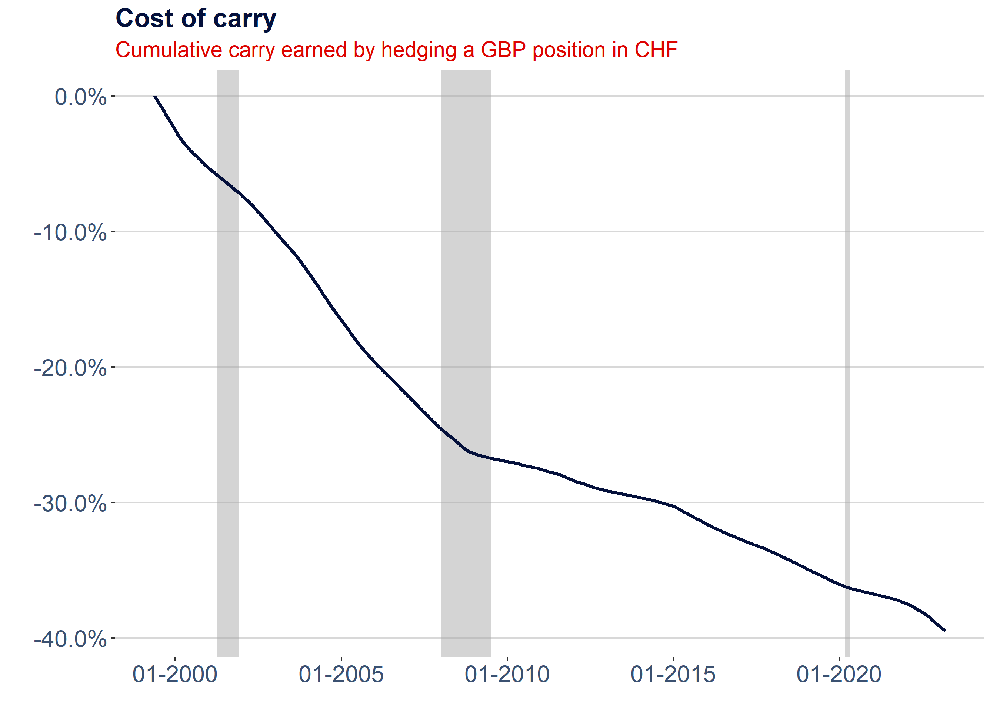

<!-- README.md is generated from README.Rmd. Please edit that file -->

# peRformance

<!-- badges: start -->
<!-- badges: end -->

The goal of peRformance is to provide a range of functions to study and
visualize market or economic data and analyize and benchmark asset
returns.

## Installation

You can install and load the development version of peRformance from
[GitHub](https://github.com/) with the following commands (if not yet
installed, install devtools from CRAN first):

``` r
# Install devtools if required
# install.packages("devtools")

# Install the package
devtools::install_github("fscheler/peRformance")

# Load the package
library(peRformance)
```

## Example application monthly performance overview table (mperfT)

Create a monthly and annual performance overview table in plotly and a
printable version that can be used in markdown documents with the kable
package. Monthly tables are a popular tool in analysis and comparison of
financial time series.

``` r

  # Generate an integrated monthly and annual performance overview using plotly
  date=seq(as.Date("2007-1-1"), as.Date("2015-1-1"), by = "days")
  asset_ret<-rnorm(length(date))/100
  benchmark_ret<-rnorm(length(date))/100
  da<-data.frame(date,asset_ret,benchmark_ret)

  # Including Benchmark Returns
  df<-mperfT(da,ts_format="returns")  
#>   Year     Jan     Feb     Mar     Apr    May    Jun    Jul    Aug    Sep
#> 1 2007   -0.3%   5.53%  -0.98%   1.04% -4.77% -5.68%  8.69%  6.51% 13.16%
#> 2 2008   8.08%   0.38%   3.36%  -2.78%  0.71% -2.82%  2.25% -0.94% -3.77%
#> 3 2009  -1.34%  -4.79% -15.17% -11.74% -9.55% -1.61%  2.55%  4.65%  5.12%
#> 4 2010  -6.61%  -1.76%  -0.05%  -0.59%  5.02%  0.84%  7.47%  6.88%  5.56%
#> 5 2011   3.68%   5.54%   1.91%  -0.48%  -0.5% -8.06% 11.12% -1.36% 15.39%
#> 6 2012   2.26%   1.85%  -8.69%   2.39% -0.31%   0.9%  7.19% -2.03%   2.4%
#> 7 2013 -10.92% -10.35%  -3.89%  -5.26%  -1.8%  5.14% -3.79% -0.07% 10.49%
#> 8 2014   5.85%  -4.49%   1.95%   1.29%  8.64% -0.55%  1.02%  1.57% -0.91%
#> 9 2015   0.17%                                                           
#>      Oct    Nov     Dec       FY Benchmark
#> 1 -7.17% -5.73% -10.27%   -2.74%     9.47%
#> 2  2.86%  2.29%    4.9%   14.79%    -12.4%
#> 3  1.09% -3.36%   2.55%  -29.26%   -23.95%
#> 4  0.75% 12.83%  -6.35%    24.6%    19.65%
#> 5   4.3% -6.93%  -4.14%   19.48%     4.81%
#> 6 11.88%  4.95%   10.6%   36.79%    33.49%
#> 7  4.28% -3.61%   0.79%   -19.2%     3.68%
#> 8 14.82%  3.59%  13.36%   54.63%    -8.27%
#> 9                          0.17%     0.18%

  #Excluding Benchmark Returns  
  df<-mperfT(da[,c("date","asset_ret")],ts_format="returns",print_output=F)
  
  # Using Index instead of Return Time Series
  date=seq(as.Date("2010-1-1"), as.Date("2015-1-1"), by = "days")
  asset_ret<-cumprod(1+rnorm(length(date))/100)
  benchmark_ret<-cumprod(1+rnorm(length(date))/100)
  da<-data.frame(date,asset_ret,benchmark_ret)
  
  df<-mperfT(da,ts_format="index",print_output=F)  
  
  # You can also configure the export options and download the plotly graphic as a high resolution svg
  df<-mperfT(da,ts_format="index",header_color="#3b5171",font_color="#04103b",export_format="svg",
                  chart_export_width=800,chart_export_height=150,print_output=F)  

  # Display Plotly Graphic
  #df$fig
```


## Example application recession shading with ggplot2 (ggRec)

Apply NBER recession shading to any ggplot2 time series graphic,
directly loading the recession indicator from the St Louis Fed. Please
note, that this function requires an API key that can be generated for
free on the Fed’s website
(<https://fred.stlouisfed.org/docs/api/api_key.html>).

``` r

# Generate a random return time series
date=seq(as.Date("2007-1-1"), as.Date("2015-1-1"), by = "days")
asset_ret<-cumprod(1+rnorm(length(date))/100)
da<-data.frame(date,asset_ret)

# Initiate a ggplot2 chart
  library(ggplot2)
  cols <- c("Time series with NBER recession shading" = "#04103b")
  p<-ggplot(data=da,aes(x=as.Date(date), y=asset_ret))
# Add recession shading using the function and your API Key  
# to obtain a key visit: https://fred.stlouisfed.org/docs/api/api_key.html
  tryCatch({
    p<-p + ggRec(as.Date(min(da$date)),as.Date(max(da$date)),fredr_key="your_api_key")
  }, error = function(e) {})
#> NULL
# add formatting  
  library(scales)
  p<-p +
# add a theme from the peRformance package
    theme_aq_black_default_font(base_size=16)+
#Add other elements
    geom_line(size=1,aes(y=asset_ret,color="Time series with NBER recession shading"))+
    scale_colour_manual(values = cols)+
    scale_x_date(labels = date_format("%m-%Y"))+
    xlab("")+
    ylab("")+
    theme(legend.position = "bottom",legend.title = element_blank())+
    theme(plot.margin=margin(l=5,r=10,b=5,t=5))
  
```


## Example application dRawdowns

Analyse frequence, magnitude and length of drawdowns in a given time
series. Please note: If the time series ends in a drawdown, the last
peak2recovery and trough2recovery values display the number of periods
since the last trough and the date of the last observation even if this
does not mark a complete recovery.

``` r

# Generate a random return time series
date=seq(as.Date("2010-1-1"), as.Date("2015-1-1"), by = "days")
asset_ret<-rnorm(length(date))/100
da<-data.frame(date,asset_ret)

# Analyze the number, magnitude and length of drawdowns
df<-dRawdowns(da,ret_format='returns',graphics=F)

# Some example output
df$longest_drawdown
#> Time difference of 884 days
df$longest_peak2trough
#> Time difference of 802 days
# Count number of drawdowns with a trough below threshold value
df$n
#>   ranges observations
#> 1   0.00           18
#> 2  -0.05            5
#> 3  -0.10            3
#> 4  -0.20            2
#> 5  -0.30            1
#> 6  -0.40            1
#> 7  -0.50            1
#> 8   0.60            0
#> 9  -0.70            0
```

## Example application rrScat & rrScatEff functions

The rrScat functions provide visual insights into the risk/return
profile of a given sample of assets. rrScat displays the annualized risk
(standard deviation) of returns and the annualized return in a scatter
plot. rrScatEff provides an interface to the ROI optimizer of the
PortfolioAnalytics package and plots the efficient frontier alongisde
the given assets.

``` r

# Generate a dataframe of random asset returns
date=seq(as.Date("2010-1-1"), as.Date("2015-1-1"), by = "days")
Asset1<-rnorm(length(date))/100+0.0005
Asset2<-rnorm(length(date))/100+0.0005
Asset3<-rnorm(length(date))/100+0.0005
Asset4<-rnorm(length(date))/100+0.0005
da<-data.frame(date,Asset1,Asset2,Asset3,Asset4)

# Plot the risk/return scatter
df<-rrScat(da,ret_format="returns",table_format='wide')
df$rr_ggplot
```


``` r

# Plot the risk/return scatter and the efficient frontier
p<-rrScatEff(da,ret_format="returns",table_format='wide')

# The function can also handle data in long format. 
# For this, the data should be arranged as follows: date, id, values
long <- melt(setDT(da), id.vars = "date")
eff<-rrScatEff(long,ret_format="returns",table_format='long')

eff$eff_ggplot
```


## Foreign Exchange Hedging

Investors are frequently exposed to the risk of foreign exchange rate
changes. The very good underlying performance of an investment,
demoninated in a foreign currency, can be (over)compensated easily by a
depreciation in the respective currency’s value compared to the
investor’s home currency. For this reason, investors regularly insure
themselves (hedge) against this risk using Swaps or Forward contracts.
However, the price of these hedges depends on the relative interest
rates level. As a rule of thumb, investor’s can’t escape their home
country’s interest rate environment without taking foreign exchange
risk. If interest rates in the foreign currency are higher, ceteris
paribus, hedging will cost money and vice versa if foreign interest
rates are lower. The cost of a hedge can, therefore, be simulated easily
using the interest rate differential. The FXhedgeR provides a generic
function that calculates the cost of carry of the hedge of any currency
pair based on two dataframes of historical FX rates and forwards points
(both can be obtained for instance from Bloomberg). For major
currencies, the function uses an example dataset hosted on GitHub by
default which, however, may not be up-to-date.

``` r

# Obtain the carry paid/earned by hedging USD exposure for a Singapore based investor
# A negative figure means, the hedge costs money, a postive figure indicates that the investor is earning carry.
df<-FXhedgeR(base_currency='SGD',exp_currency='USD')
tail(df$hedge_cost_perc,1)
#>         Dates     Hedge
#> 1: 2023-03-07 -0.013948

# Obtain the carry paid/earned by hedging GBP exposure for a Swiss investor with user-given data
df<-
FXhedgeR(base_currency='CHF',exp_currency='GBP',
         fxrates_gui=read_delim(url('https://raw.githubusercontent.com/fscheler/opendata/main/fx_rates.csv'),delim = ";",show_col_types = FALSE),
         fxforwards_gui=read_delim(url('https://raw.githubusercontent.com/fscheler/opendata/main/fx_forwards.csv'),delim = ";",show_col_types = FALSE)
)

head(df$hedge_perf)
#>         Dates     Hedge
#> 1: 1999-05-20 0.9998394
#> 2: 1999-05-21 0.9996787
#> 3: 1999-05-24 1.0050651
#> 4: 1999-05-25 1.0086278
#> 5: 1999-05-26 0.9967644
#> 6: 1999-05-27 0.9947610
tail(df$hedge_cost_perc)
#>         Dates       Hedge
#> 1: 2023-02-28 -0.03138301
#> 2: 2023-03-01 -0.03035254
#> 3: 2023-03-02 -0.02991483
#> 4: 2023-03-03 -0.02987529
#> 5: 2023-03-06 -0.02821794
#> 6: 2023-03-07 -0.02795312
tail(df$cumulative_hedge_cost)
#>         Dates     Hedge
#> 1: 2023-02-28 0.6058789
#> 2: 2023-03-01 0.6058059
#> 3: 2023-03-02 0.6057340
#> 4: 2023-03-03 0.6056622
#> 5: 2023-03-06 0.6055944
#> 6: 2023-03-07 0.6055272
```



## Dependencies

The package references the following packages:

lubridate, fredr, ecm, ggplot2, dplyr, scales, fredr, purrr,
PortfolioAnalytics, ecm, plotly, tidyverse, caTools, zoo, data.table,
tibble
